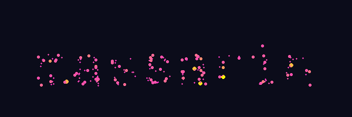

# GUGS - Github Username Gravity Simulation

Create animated GIFs with particles forming text that evolve under gravitational forces.

```bash
gugs massarin --reverse
```



## Installation

### From source
```bash
pip install -e .
```

### From GitHub
```bash
pip install git+https://github.com/massarin/gugs.git
```

## Usage

```bash
gugs <text> --<option>
```

```
positional arguments:
  text                  Text to display (default: GUGS)

options:
  -h, --help            show this help message and exit
  --width WIDTH         Width of the animation (default: 600)
  --height HEIGHT       Height of the animation (default: 200)
  --n-particles N_PARTICLES
                        Number of particles (default: 200)
  --power-law POWER_LAW
                        Power law exponent for initial velocities (default: -1.0)
  --G G                 Gravitational constant (default: 10.0)
  --dt DT               Time step for simulation (default: 0.01)
  --simulation-speed SIMULATION_SPEED
                        Simulation speed multiplier (default: 2.0)
  --gif-duration GIF_DURATION
                        Duration of GIF in seconds (default: 20.0)
  --fps FPS             Frames per second (default: 10)
  --reverse             Add reverse playback with accelerating speed at the end
  --reverse-duration REVERSE_DURATION
                        Duration of reverse playback in seconds (default: 5.0)
  --output OUTPUT, -o OUTPUT
                        Output filename (default: gugs.gif)
```

## Dependencies
- numpy
- imageio
- pillow
- numba
