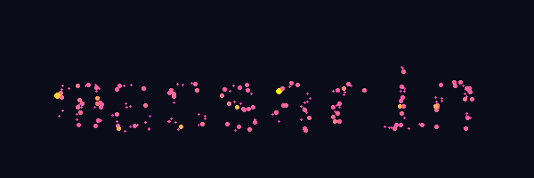

# GUGS - Github Username Gravity Simulation

Create animated GIFs with particles forming text that evolve under gravitational forces.

```bash
gugs massarin --reverse
```



## Installation

### From source
```bash
pip install -e .
```

### From GitHub
```bash
pip install git+https://github.com/massarin/gugs.git
```

## Usage

```bash
gugs <username>
```

## Dependencies
- numpy
- imageio
- pillow
- numba
